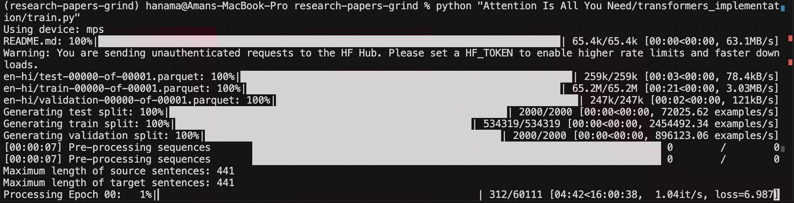
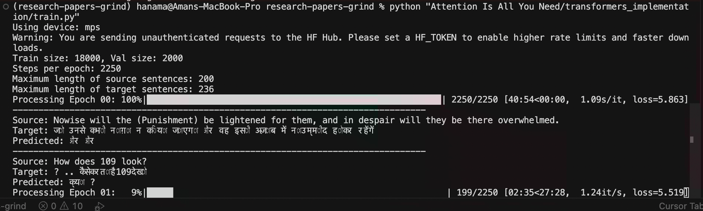
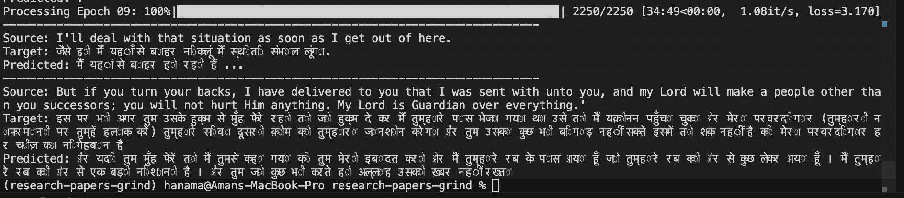

# Attention Is All You Need

> My notes on the paper *"Attention Is All You Need"* [arXiv:1706.03762](https://arxiv.org/abs/1706.03762) 

I started with [Umar Jamil’s walkthrough](https://youtu.be/bCz4OMemCcA?si=nqAYmab8ZEfwyO6F), which breaks down the encoder–decoder stack, multi-head attention, and positional encoding in a way that maps cleanly onto the original paper. The companion PDF in this folder (`transformers_theory_umar_jamil.pdf`) is my working reference while I read the paper itself.

**Implementation:** [Transformer from scratch](transformers_implementation/) following [Umar Jamil’s coding series](https://www.youtube.com/watch?v=ISNdQcPhsts&t=232s).

### Datasets

Umar’s tutorial uses **[Helsinki-NLP/opus_books](https://huggingface.co/datasets/Helsinki-NLP/opus_books)** (`en-it`, ~32k pairs) — small enough for a ~1 hour/epoch run on a laptop.

I wanted **English → Hindi**, so I looked at:

- **[Helsinki-NLP/opus-100](https://huggingface.co/datasets/Helsinki-NLP/opus-100)** (`en-hi`, ~534k train pairs)
- **[cfilt/iitb-english-hindi](https://huggingface.co/datasets/cfilt/iitb-english-hindi)** (~1.6M pairs)

### Full-scale run was too slow

I started with **opus-100 / en-hi** (full train split). With `batch_size=8` and `num_epochs=10`, that’s ~**60k steps/epoch** — roughly **15+ hours per epoch** on Apple MPS (~7 days for 10 epochs). Not practical for a side project on a Mac.

### Subset run (what I actually trained)

I cut the train split to **20k pairs** from opus-100, then fixed the split as **18k train / 2k validation**:

1. Load `Helsinki-NLP/opus-100`, config `en-hi`, split `train`
2. `shuffle(seed=42)` → take first **20,000** rows
3. Rows `0–17,999` → train, rows `18,000–19,999` → validation
4. Build tokenizers on the full 20k subset
5. In `BilingualDataset`, each sentence is built by **concatenating** `[SOS] + tokens + [EOS] + [PAD]` to fixed length (`seq_len=350`)

That gave **2,250 steps/epoch** (~30–40 min/epoch) instead of ~60k.

**Training started:**

**Training finished (10 epochs, loss ~5.9 → ~3.1):**

Translations are rough. The goal here was to **implement and run** the full pipeline en-hi MT